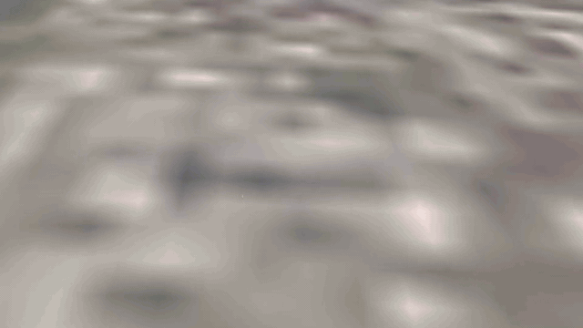

# Terratile

[](https://github.com/nam-digital-twins/terratile/releases)
[](https://github.com/nam-digital-twins/terratile/actions/workflows/ci.yml)
[](https://www.npmjs.com/package/@nam-digital-twins/terratile)
[](https://github.com/nam-digital-twins/terratile/releases)
[](LICENSE)
[](CODE_OF_CONDUCT.md)
[](https://nam-digital-twins.github.io/terratile/)
[](https://nam-digital-twins.github.io/terratile/docs/)

<!-- Hero GIF (images/terratile-demo.gif), generated from the demo clip with
     ffmpeg. It loops inline on github.com. -->


**Terratile** is an engine-agnostic runtime for streaming
[3D Tiles](https://github.com/CesiumGS/3d-tiles) (including Google
Photorealistic 3D Tiles) into your own apps: flight simulators, games,
explainers, digital twins, and more. It ships a **PlayCanvas integration** and
works with any 3D Tiles provider.

## Features

- **Any 3D Tiles source** through one interface: Google Photorealistic 3D Tiles,
  Cesium ion, or tileset URLs.
- **Smooth streaming.** Level of detail refines as the camera moves and stays
  interactive under heavy load.
- **PlayCanvas integration.** Drop tiles into your scene, anchored to a real
  location, with one script.
- **Ground snapping.** Keep entities glued to the tile surface as it refines.
- **Clipping and cutouts.** Crop tiles to a polygon or punch holes in them,
  with smooth shader edges.
- **Tile caching.** In-memory and optional persistent cache for fast revisits.

## Getting started

Get a credential from one provider:

- **Google Maps API key.** Enable the Map Tiles API in Google Cloud
  ([setup guide](https://developers.google.com/maps/documentation/tile/get-api-key)).
- **Cesium ion token.** A free [Cesium ion](https://cesium.com/ion/) account
  includes Google Photorealistic 3D Tiles as asset `2275207`.

Install from npm:

```
npm install @nam-digital-twins/terratile
```

Or load the UMD bundle from a CDN (it attaches a `terratile` global):

```html
<script src="https://unpkg.com/@nam-digital-twins/terratile/dist/terratile.js"></script>
```

To build from source instead, clone the repo, then run `npm install` and
`npm run build` to produce `dist/terratile.js`.

### With PlayCanvas (simplest)

Attach the `tileRenderer` script to an entity and point it at your credential and
camera:

```js
const tiles = new pc.Entity();
app.root.addChild(tiles);
tiles.addComponent('script');
tiles.script.create('tileRenderer', {
    attributes: {
        provider: 'cesium-ion',        // 'google' | 'cesium-ion' | 'url'
        apiKey: '<YOUR_CESIUM_ION_TOKEN>',
        assetId: 2275207,              // Google Photorealistic 3D Tiles on Cesium ion
        camera: myCameraEntity,
        useLocalFrame: true,
        originLon: 21.7346,
        originLat: 38.2466
    }
});
```

### Any engine

Create a tile source and drive a `TileManager` from your own render loop:

```js
const source = new terratile.GoogleTilesetSource('<YOUR_GOOGLE_API_KEY>');
const manager = new terratile.TileManager(source, handlers);
```

See the [examples](#examples) and the
[API reference](https://nam-digital-twins.github.io/terratile/docs/) for the
handler interface and all options.

## Examples

- [`examples/basic-viewer`](examples/basic-viewer): tile streaming plus ground
  snapping ([live](https://nam-digital-twins.github.io/terratile/examples/basic-viewer/)).
- [`examples/tile-clip-viewer`](examples/tile-clip-viewer): polygon crop plus
  cutouts ([live](https://nam-digital-twins.github.io/terratile/examples/tile-clip-viewer/)).

Live demos and full API reference: <https://nam-digital-twins.github.io/terratile/>

## Contributing and help

Contributions are welcome. See [CONTRIBUTING.md](CONTRIBUTING.md) and the
[Code of Conduct](CODE_OF_CONDUCT.md). Ask questions in
[Discussions](https://github.com/nam-digital-twins/terratile/discussions) or
[Issues](https://github.com/nam-digital-twins/terratile/issues). Report security
problems privately per [SECURITY.md](SECURITY.md).

## License

terratile is licensed under the **Apache License 2.0** (see [LICENSE](LICENSE)
and [NOTICE](NOTICE)). Use it for any purpose, including commercially. You only
need to keep the copyright and NOTICE attribution in copies and derivative
works. No visible or on-screen credit is required.

terratile incorporates third-party open-source components. See
[THIRD_PARTY_NOTICES.md](THIRD_PARTY_NOTICES.md).
